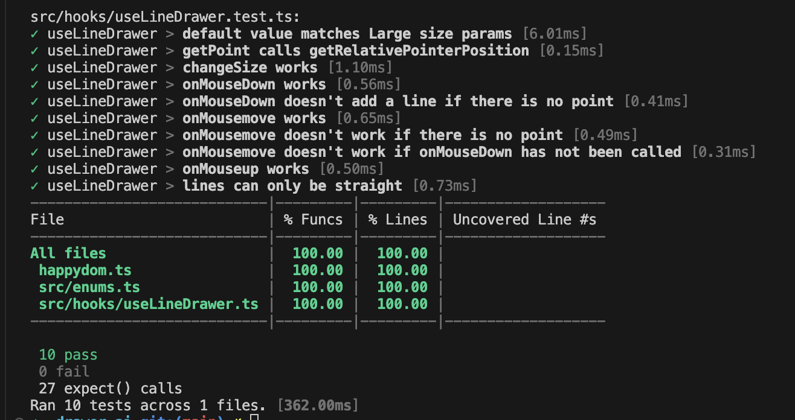

# Drawer.ai test task

## Installation

```bash
# if you don't have bun
curl -fsSL https://bun.sh/install | bash

# dependency installation
$ bun install
```

## Running the app

```bash
# development
$ bun dev

# build
$ bun run build
```

## Test

```bash
# unit tests with coverage
$ bun test
```


